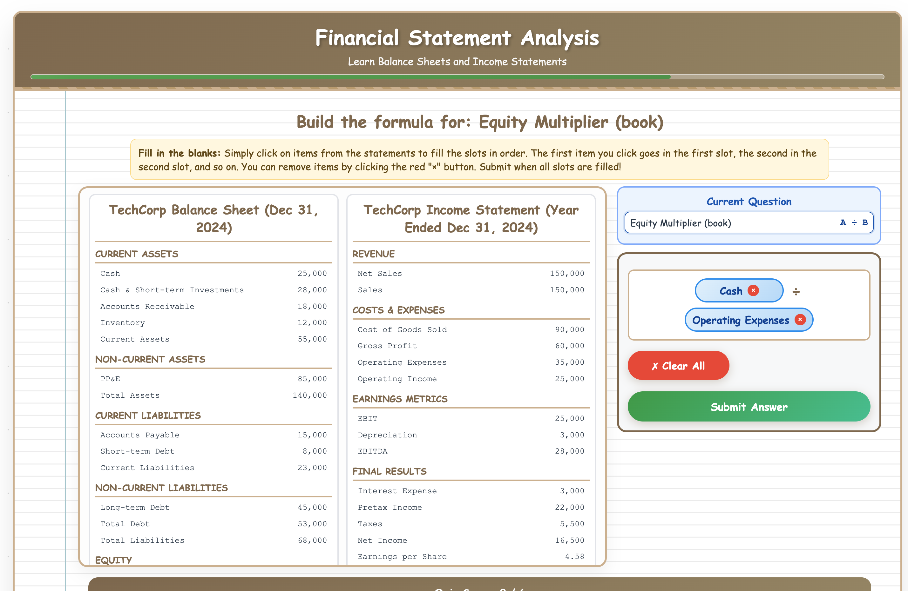

# Econ Interactive Learning

**Live site:** [https://www.mengshanzhao.com/teaching/335](https://www.mengshanzhao.com/teaching/335)  
Learning-by-doing mini games for undergraduate econ/finance courses. Built to make online learning faster, clearer, and more fun.

---

## Why this exists
I teach online. Some concepts (T-accounts, cash flows, ratios) stick better with short, focused practice. I built these games to help students practice quickly, get instant feedback, and see the “why,” not just the “what.”

---

## Games

### Tax — [Play here](https://www.mengshanzhao.com/teaching/335/chapter-1)
Timed questions on profitability, liquidity, and leverage; randomized each run.
### Financial and Income Statement — [Play here](https://www.mengshanzhao.com/games/financial-statements-game.html)
What is finance/income statement and how do you calculate 10+ different ratios calculation in easy step, instead of 100 slides.
### Present and Future Ratios — [Play here](https://www.mengshanzhao.com/teaching/335/chapter-3)
How to calculate the present or future value with a rocket.

**Preview:**



---

### Cashflow Sprint and a lot more! *(coming soon)*
Drag-and-drop transactions into Operating / Investing / Financing sections. Updated weekly.

---

## Tech
- **Frontend:** Vanilla JavaScript + HTML/CSS (Tailwind for styling)
- **Deployment:** Hosted on Vercel
- **Features:** Randomized question generation, instant feedback

---

## Local development

To run this project locally:

1. Install [Node.js](https://nodejs.org/) (v18+ recommended)
2. Clone this repository:
   ```bash
   git clone https://github.com/MengshanZhao/econ-interactive-learning.git
   cd econ-interactive-learning
