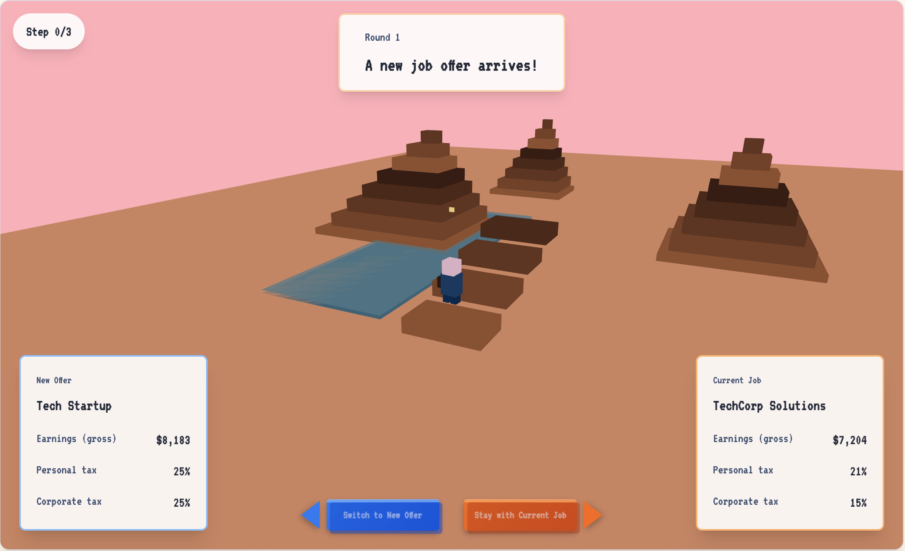
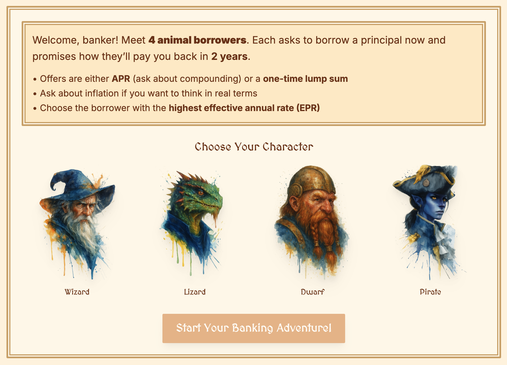
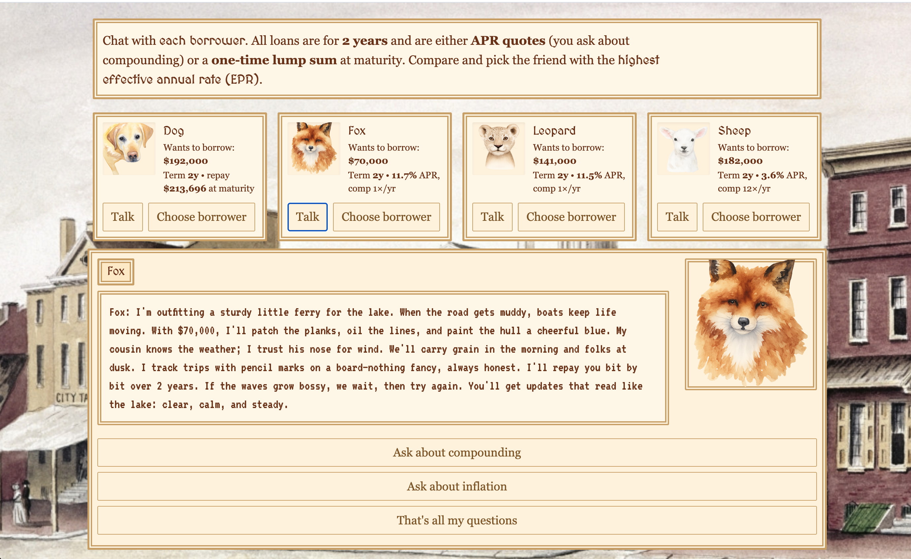
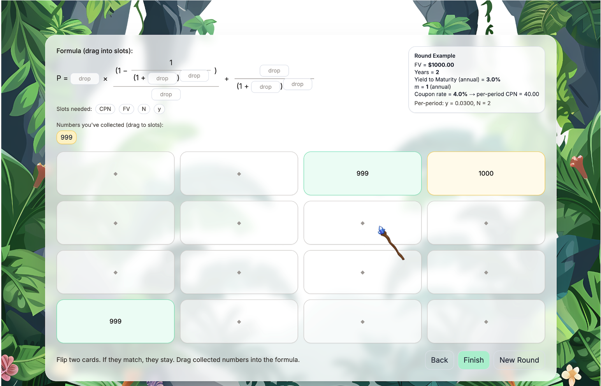
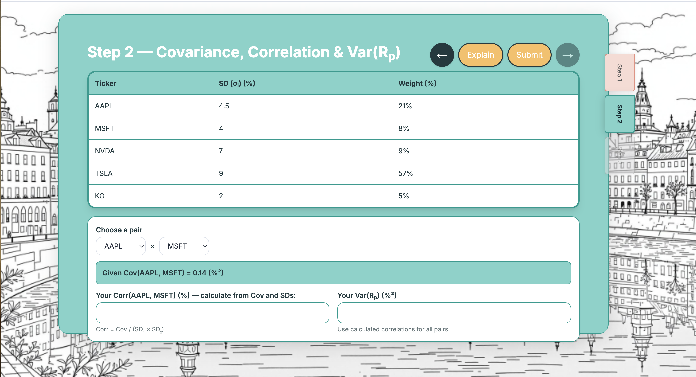

# Econ Interactive Learning

**Live site:** [https://www.mengshanzhao.com/teaching/335](https://www.mengshanzhao.com/teaching/335)  
Learning-by-doing mini games for undergraduate econ/finance courses. Built to make online learning faster, clearer, and more fun.

---

## Why this exists
I teach online. Some concepts (T-accounts, cash flows, ratios) stick better with short, focused practice. I built these games to help students practice quickly, get instant feedback, and see the “why,” not just the “what.”

---

## Games

### Tax — [Play here](https://www.mengshanzhao.com/teaching/335/chapter-1)
Timed questions on profitability, liquidity, and leverage; randomized each run.

### Financial and Income Statement — [Play here](https://www.mengshanzhao.com/games/financial-statements-game.html)
What is finance/income statement and how do you calculate 10+ different ratios in easy steps, instead of 100 slides.

### Present and Future Ratios — [Play here](https://www.mengshanzhao.com/teaching/335/chapter-3)
How to calculate the present or future value with a rocket.

### TVM Rocket — Cash Flow PV — [Play here](https://www.mengshanzhao.com/teaching/335/chapter-4)
Present value of cash-flow streams, perpetuities, and annuities with visual timelines and a 6-question quiz; randomized each run.

### Bank Boss — Animal Borrowers — [Play here](https://www.mengshanzhao.com/teaching/335/chapter-5)
Act as the bank: evaluate loan requests from animal borrowers; practice APR vs EAR and level-payment loans.

### Bond Memory — Pricing Game — [Play here](https://www.mengshanzhao.com/teaching/335/chapter-6)
Memory game plus bond pricing: match cards and drag numbers into the PV formula (coupon vs zero-coupon bonds).

### Stock Valuation — [Play here](https://www.mengshanzhao.com/teaching/335/chapter-7)
RPG-style: chat with animal sellers, make offers or pass; learn dividend discount models (constant and two-stage growth).

### Investment Decision — [Play here](https://www.mengshanzhao.com/teaching/335/chapter-8)
Compare two projects using NPV, IRR, payback, and profitability index; practice when metrics disagree.

### Incremental Earnings Practice — [Play here](https://www.mengshanzhao.com/teaching/335/chapter-9)
Work through incremental earnings, EBIT, and tax shield with a typewriter-style lesson and randomized practice.

### Returns Lab — [Play here](https://www.mengshanzhao.com/teaching/335/chapter-11)
Real stock data (AAPL, MSFT, TSLA, KO); compute realized returns with step-by-step analysis.

### Portfolio Covariance Lab — [Play here](https://www.mengshanzhao.com/teaching/335/chapter-12)
Portfolio risk and return with five stocks; explore covariance, correlation, and diversification.

### Weighted Average Cost of Capital: A Card Game — [Play here](https://www.mengshanzhao.com/teaching/335/chapter-13)
Reveal cost of equity, cost of debt, and equity share; bet on whose WACC is lower in a card-game format.

**Preview (Selected):**








---

## Tech
- **Frontend:** Vanilla JavaScript + HTML/CSS (Tailwind for styling)
- **Deployment:** Hosted on Vercel
- **Features:** Randomized question generation, instant feedback

---

## Local development

To run this project locally:

1. Install [Node.js](https://nodejs.org/) (v18+ recommended)
2. Clone this repository:
   ```bash
   git clone https://github.com/MengshanZhao/econ-interactive-learning.git
   cd econ-interactive-learning
